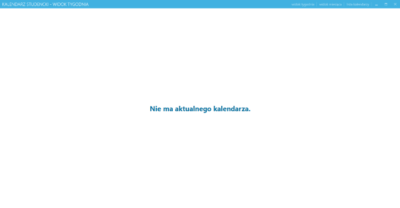
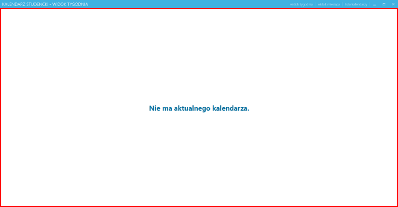
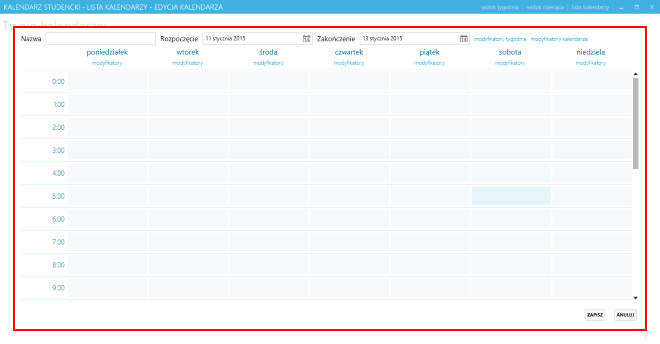
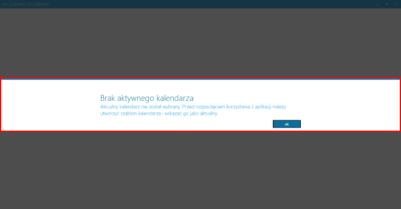

# Kalendarz studencki - projekt UI

Ta część dokuemtnacji opisuje *view-model* i bezpośrednio powiązane z nim
części.

## Spis treści

<!-- MarkdownTOC -->

- [Ogólny zarys interfejsu](#ogólny-zarys-interfejsu)
- [Główne ekrany](#główne-ekrany)
    - [Wyświetlanie planu zajęć](#wyświetlanie-planu-zajęć)

<!-- /MarkdownTOC -->

## Ogólny zarys interfejsu

Interfejs jest podzielony na kilka różnych poziomów:

 * *Shell* - główne okno wraz z belką tytułową i menu:
   
 * *Main* - główne ekrany(np. lista kalendarzy):
   
 * *Popup* - okna, które są wyświetlane ponad głównym ekranem:
   
 * *Dialog* - okna dialogowe, np. okna komunikatów czy błędów:
   

Każdy element wyświetlany na ekranie(w szczególności wymienione powyżej), który
odznacza się logiką w ramach tego projektu(czyli rzeczywiście dotyczy projektu a
nie jest np. kontolką WPF), posiada swoją klasę *view-model*u.

Większość *view-model*i jest autonomiczna i jest co najwyżej wywoływana z
poziomu innego *view-model*u (np. w celu modyfikacji któregoś z obiektu-dzieci).
Wyjątkiem są *view-model*e obsługujące przedziały aktywności - są one jawnie
osadzane w *view-model*u odpowiadającym za edycję modyfikatorów.

## Główne ekrany

W aplikacji istnieją trzy ekrany główne:

 1. `CurrentWeekViewModel` - wyświetla plan aktualnego tygodnia(podzielonego
    na poszczególne dni).
 2. `MonthViewModel` - wyświetla aktualny "miesiąc", tj. dwa tygodnie w przód i
    w tył. Plan jest wyświetlany całościowo dla całego tygodnia, bez podziału
    na poszczególne dni.
 3. `CalendarsViewModel` - wyświetla listę kalendarzy i pozwala nią zarządzać,
    jest to też miejsce, gdzie rozpoczyna się edycja szablonów.

### Wyświetlanie planu zajęć

Wyświetlenie planu polega na pobraniu aktualnego kalendarza(o ile to możliwe),
zaaranżowaniu układu planu i przekazanie odpowiednich danych do widoku.

`CurrentWeekViewModel` pobiera tylko jeden, aktualny, tydzień(o ile to możliwe).
Wymaga to tylko sprawdzenia, czy kalendarz dla danego tygodnia istnieje.
`MonthViewModel` - pobiera nie więcej niż dwa tygodnie wstecz i dwa w przód (o
ile to możliwe, jeśli nie ma wygenerowanych danych tygodni, to pobiera tylko
tyle, ile może).

Proces aranżowania wykonywany jest przez `ILayoutArranger`(`LayoutArranger`) i
polega na rozłożeniu zajęć w odpowiednie sloty