Title:   Kalendarz studencki - sposób użycia
Authors: Jakub Fijałkowski

# Kalendarz studencki - sposób użycia

Ten plik pozwala na zapoznanie się z przykładowym scenariuszem użycia, który prowadzi użytkownika od pierwszego uruchomienia aż do stworzenia przykładowego kalendarza.

### Pierwsze uruchomienie

Tuż po pierwszym uruchomieniu, użytkownikowi ukaże się wiadomość o braku aktywnego kalendarza.
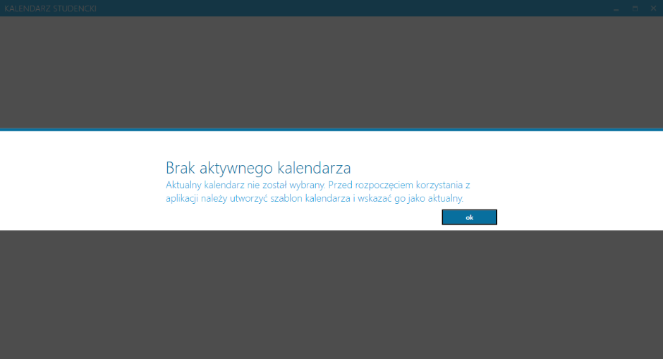

Po kliknięciu "OK", użytkownikowi zostanie wyświetlony ekran listy kalendarzy, na którym może dodać nowy kalendarz używając przycisku oznaczonego `+`:
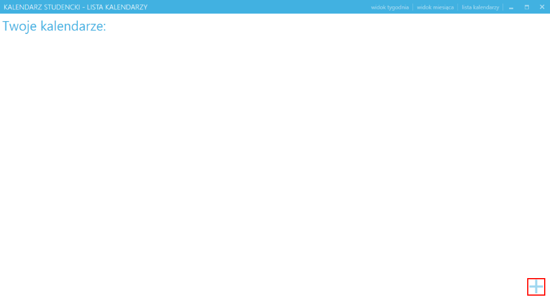

Użytkownik może w dowolnym momencie przejść do tego ekranu używając przycisku "lista kalendarzy" na pasku tytułowym:
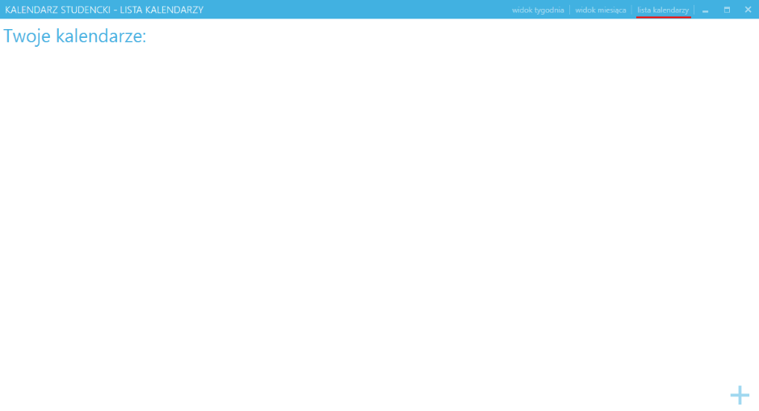

### Tworzenie i edycja kalendarza

Po wciśnięciu przycisku `+` użytkownik zostaje przeniesiony do ekranu edycji kalendarza:
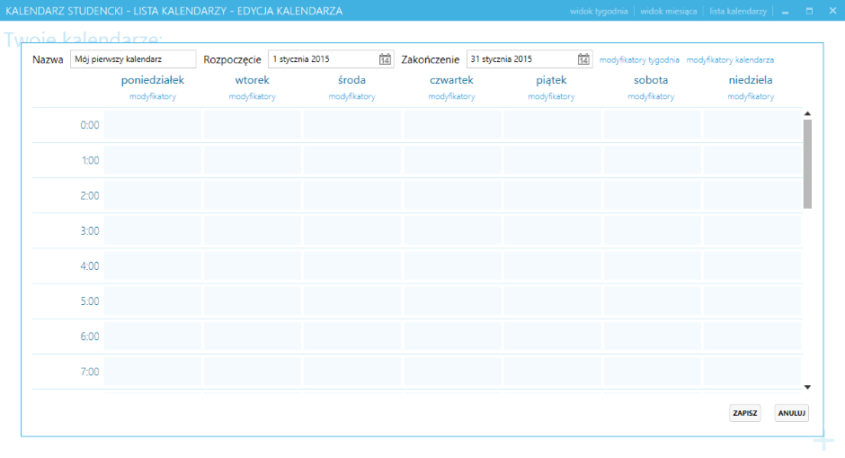

Może tutaj uzupełnić podstawowe informacje na temat kalendarza(takie jak nazwa czy czas aktywności), dostać się do listy modyfikatorów poszczególnych dni, tygodnia oraz ogólnych. Może tutaj również edytować siatkę godzin kalendarza, czyli główną część aplikacji.

Dodawanie zajęć odbywa się przez wybranie odpowiedniego slotu, w którym początkowo mają się znaleźć zajęcia, i kliknięcie na niego. Wybierzmy np. godzinę 8:00 we wtorek:
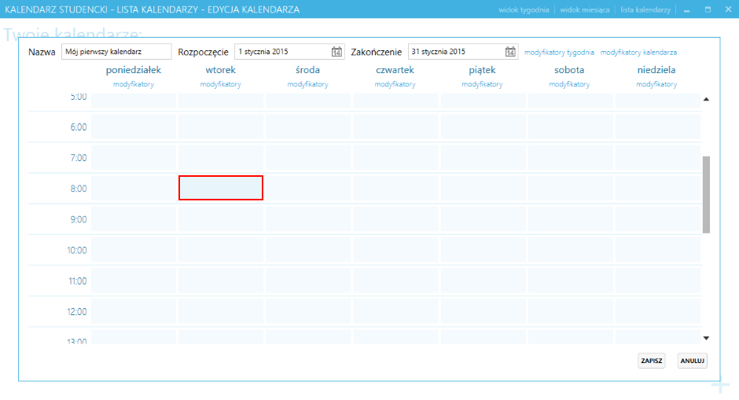

Po wybraniu odpowiedniego slotu ukaże się ekran edycji zajęć. Z jego poziomu można edytować podstawowe informacje o zajęciach oraz zmieniać modyfikatory przypisane do danych zajęć(o czym za chwilę):
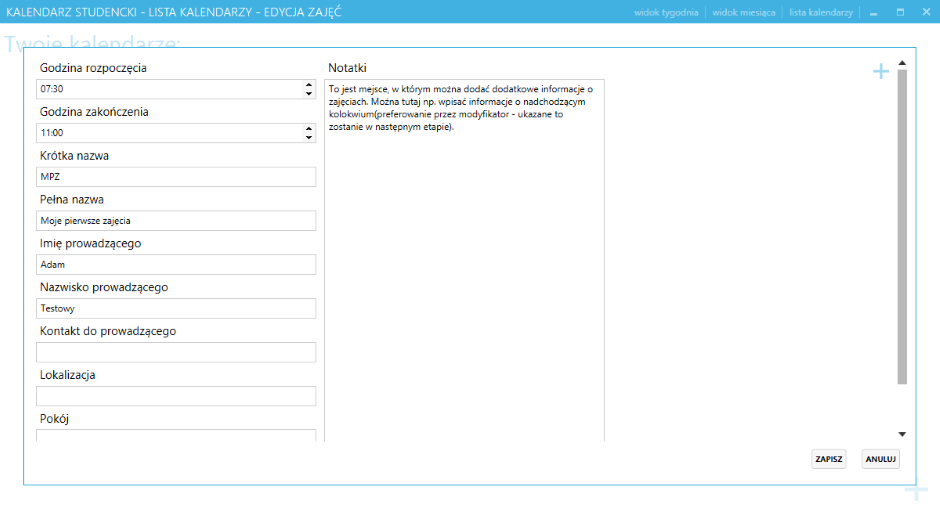

Po zapisaniu powyższych zajęć slot na ekranie edycji kalendarza będzie zajęty.
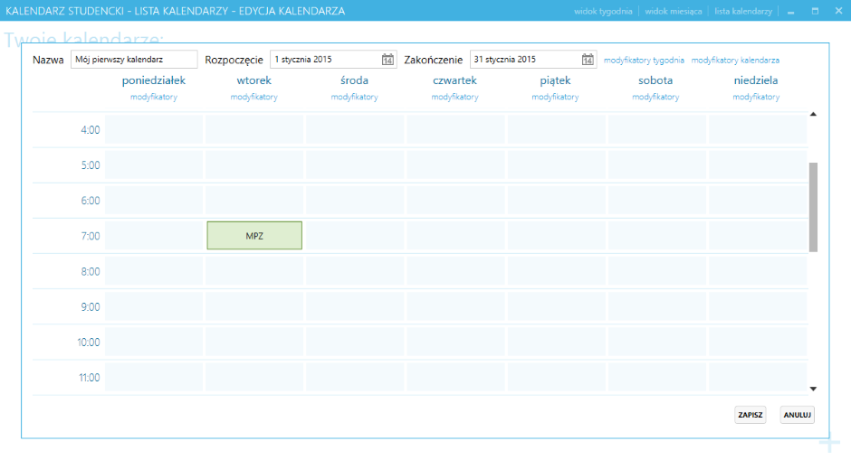

Jak widać, mimo iż dodawaliśmy zajęcia do slotu o godzinie 8:00, to przez zmianę godziny rozpoczęcia na 7:30 pojawiły się one o godzine wcześniej. Dzieje się tak ponieważ aplikacja na szablonie siatki godzin wyświetla zajęcia tylko w slocie będącym godziną rozpoczęcia(obciętą do pełnych godzin, w tym wypadku do 7:00).

Dodajmy kolejne zajęcia, tym razem z modyfikatorem. Niech będą one w czwartek od 10:00 do 11:00. Znak `+` w prawym górnym rogu ekranu edycji zajęć pozwala na dodanie modyfikatorów - elementów, które zmieniają dane elementu tylko w określone dni. Po wciśnięciu go ukaże nam się lista dostępnych modyfikatorów:
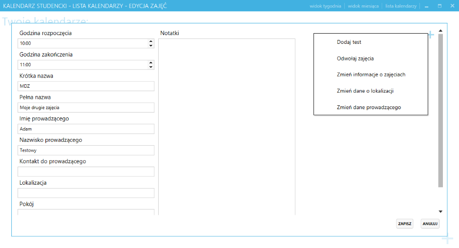

Analogicznie dodawane są modyfikatory do dni, tygodni i kalendarza - wyjątkiem jest brak możliwości edycji innych danych(wyświetlana jest tylko lista modyfikatorów).

Wracając do naszych zajęć - dodajmy modyfikator dodający test do zajęć:
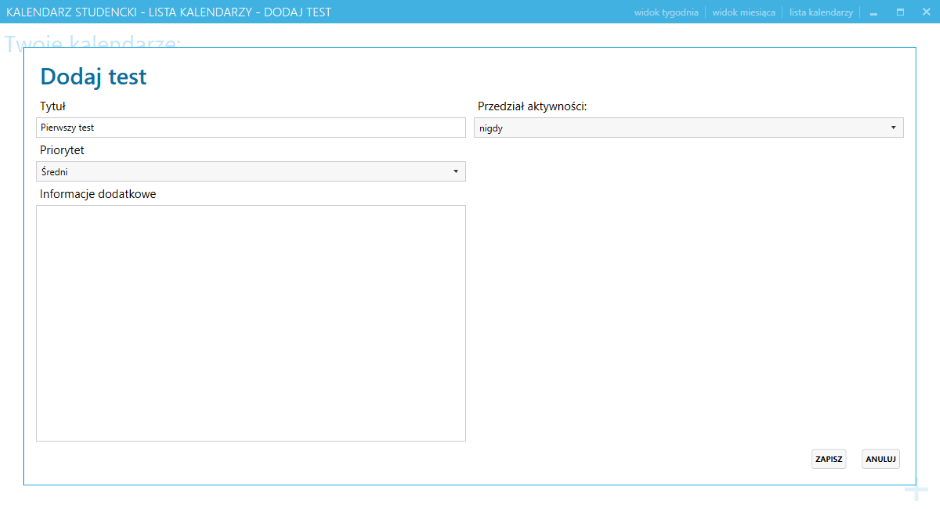

Każdy modyfikator posiada własny ekran, na którym można edytować informacje o nim. Tutaj dla przykładu użytkownik może nadać tytuł testowi, dodatkowe notatki i priorytet.
Informacje o tekście dodawane są do notatek. Priorytet określa, w którym miejscu się one znajdą:

 * Niski - na końcu notatek,
 * Średni - na początku notatek,
 * Wysoki - na początku notatek, zapisany WIELKIMI LITERAMI.

Każdy ekran edycji modyfikatora pozwala na zmianę przedziału aktywności, określającego kiedy modyfikator ma się uruchamiać(nie dotyczy modyfikatorów kalendarza, które są zawsze aktywne):
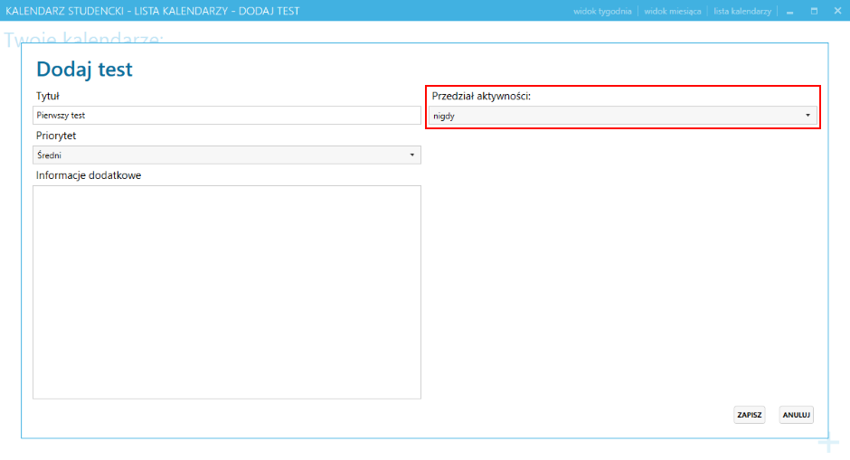

Znajduje się tam lista rozwija, która pozwala na wybranie pasującego przedziału:
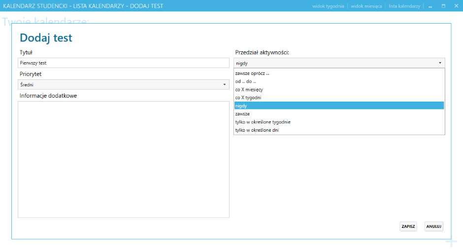

Po wybraniu żądanego przedziału można edytować jego właściwości:
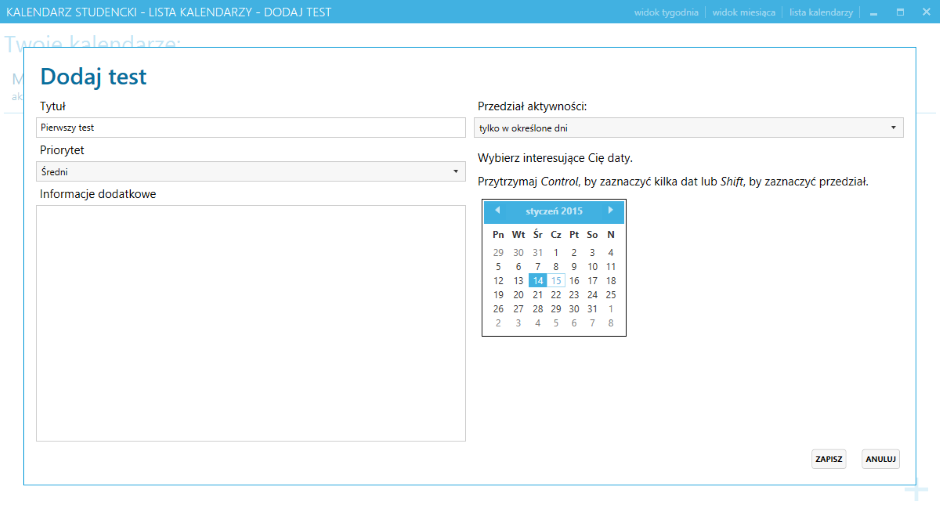

Po zapisaniu modyfikatora(tutaj: aktywnego tylko 15 stycznia 2015) zostanie on wyświetlony na liście, gdzie można go edytować(ikona ołówka) lub usunąć(ikona kosza):
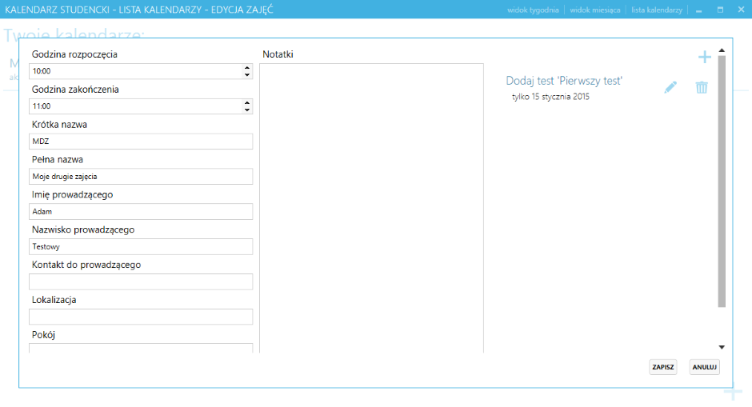

Po zapisaniu powyższych zajęć, zostaną one dodane do siatki. Zajęcia można edytować klikając na nie lewym przyciskiem myszy(procedura analogiczna do powyższej). Dodatkowo, naciskając prawym przyciskiem myszy na zapełniony slot, można dodać kolejne zajęcia w tym samym slocie, usunąć go lub jawnie wybrać edycję:
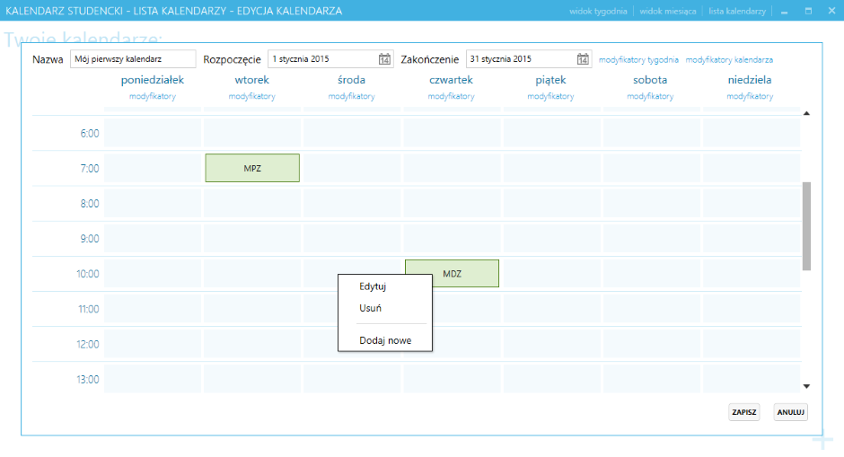

W ramach tego dokumentu dodamy dodatkowe zajęcia w tym samym dniu i tych samych godzinach co *MDZ*, jednakże będą one odwołane w każdy dzień oprócz 22 stycznia 2015:
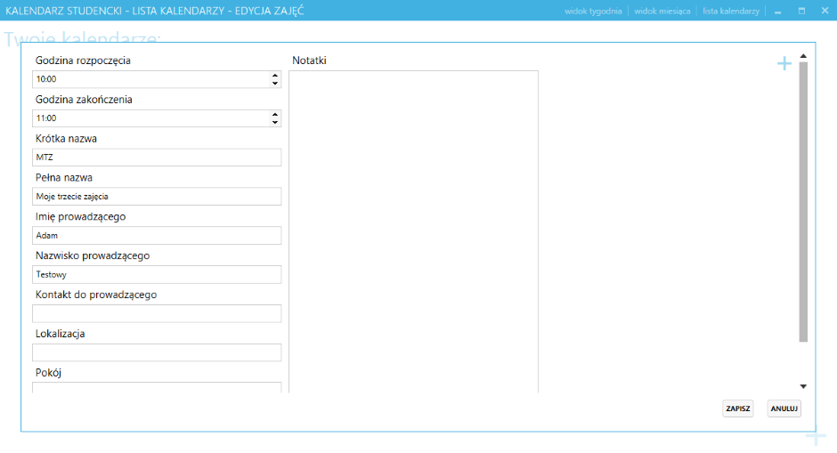

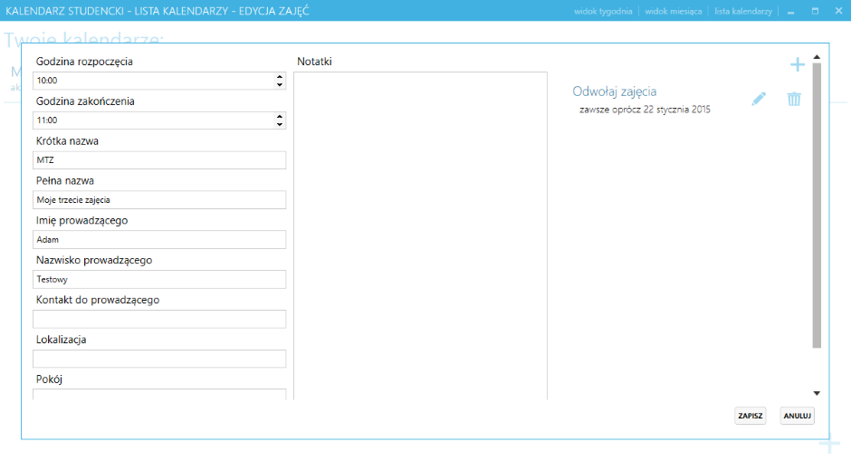

Finalnie siatka przykładowego kalendarza będzie wyglądać tak:
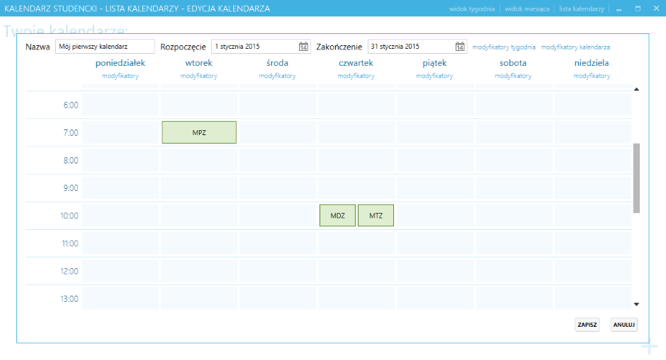

Po zapisaniu ukaże się on na liście kalendarzy, gdzie można go edytować(ikona ołówka), usunąć(ikona kosza) lub wskazać jako aktywny(ikona serca):
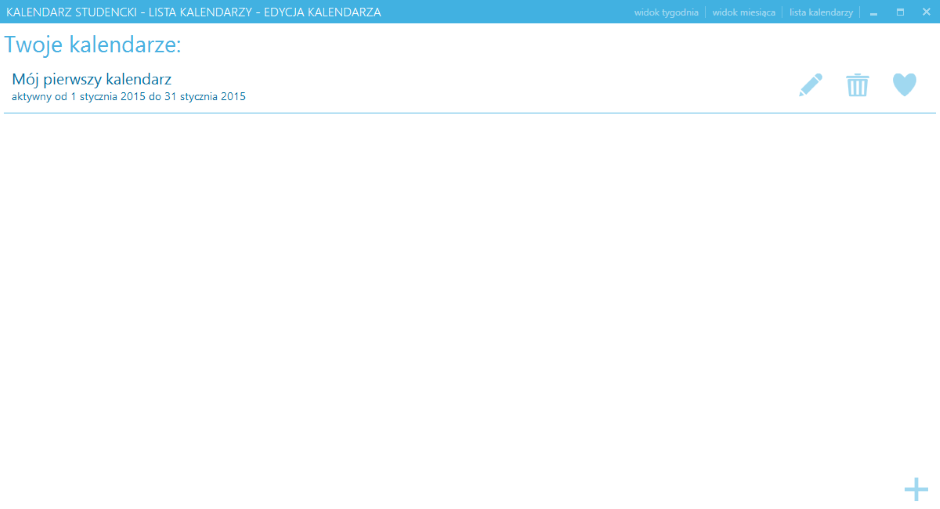

Aplikacja pozwala na utrzymywanie wielu kalendarzy(nawet nakładających się), ale tylko jeden może być aktywny w danym momencie. Aplikacja nie pozwala też na usunięcie aktywnego kalendarza.
Na potrzeby tekstu utworzony kalendarz zostanie wybrany:
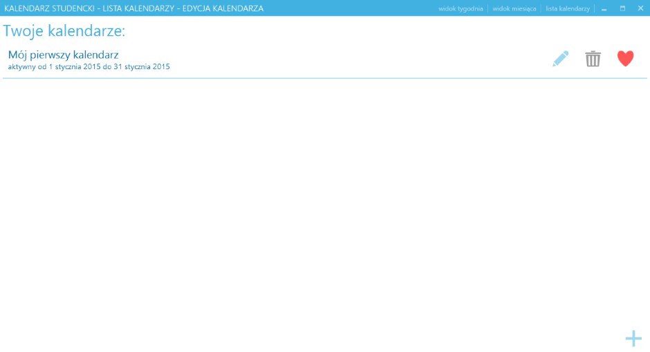

### Wyświetlanie kalendarza

Aplikacja pozwala na dwa tryby wyświetlania kalendarza: widok tygodnia i widok miesiąca. Dostęp do nich jest z poziomu paska tytułowego i obecnych tam przycisków:
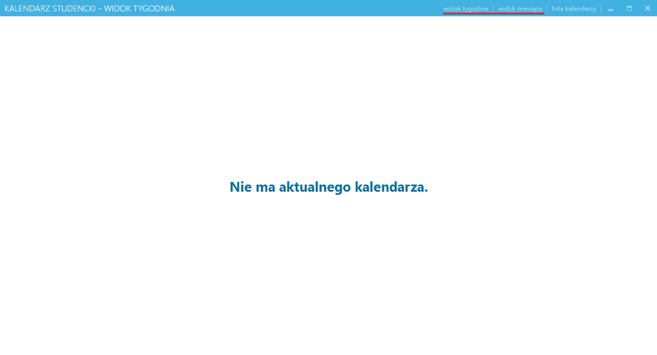

Widok tygodnia wyświetla plan w aktualnym tygodniu z podziałem na dni. Aplikacja stara się umieścić jak najwięcej informacji na ekranie(m.in. dodaje notatki), ale stara się też pozostać przejrzystą i dlatego dostosowuje się do szerokości okna.

Używając wcześniej utworzonego kalendarza, tak wygląda plan na wtorek 13.01.2015:
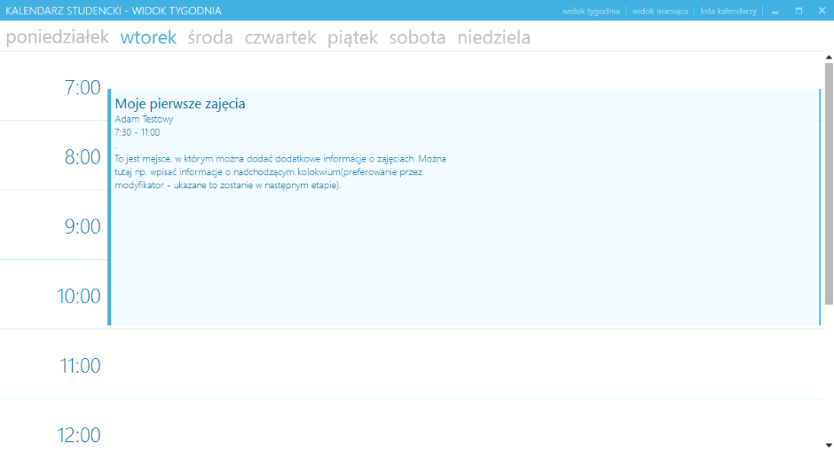

na czwartek 15.01.2015
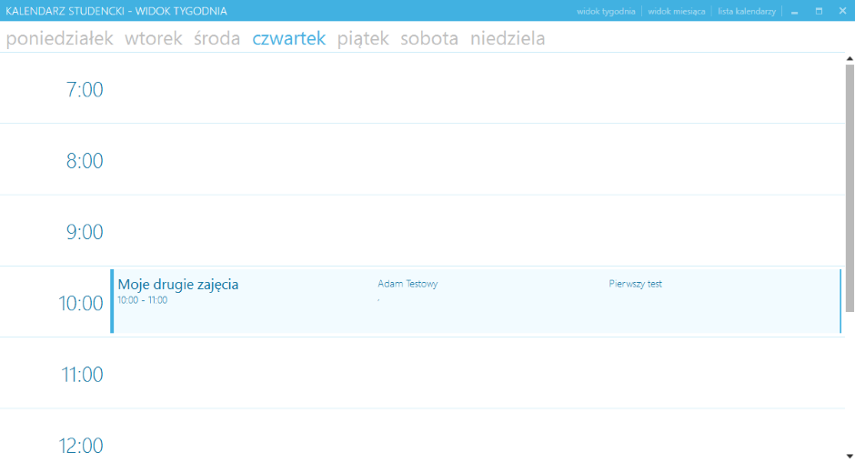

oraz na czwartek 22.01.2015:
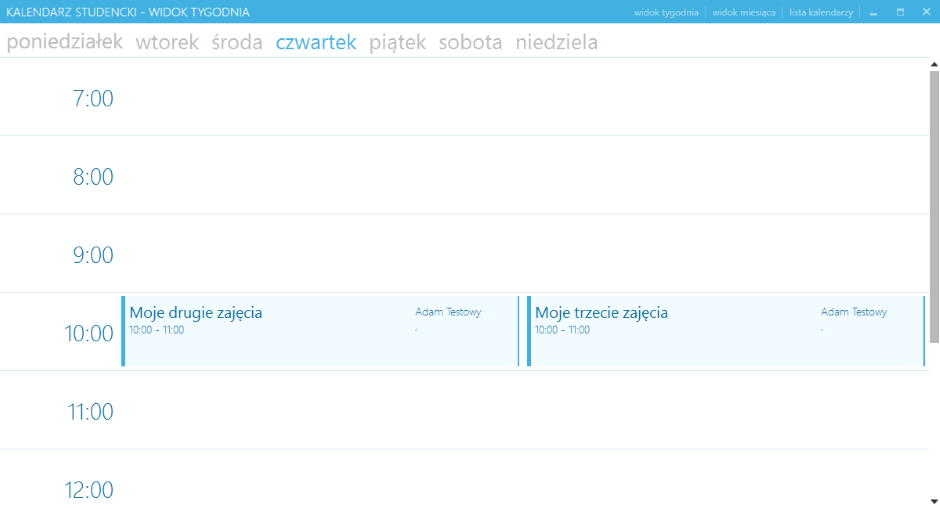

Widok miesiąca pokazuje aktualny tydzień oraz co najwyżej dwa tygodnie wstecz i wprzód. Nie ma tutaj podziału na dni, więc wszystkie zajęcia z całego tygodnia są wyświetlane na jednym ekranie. Pozwala to wyświetlić mniej informacji, jednak daje możliwość rozeznania się w planie na cały tydzień.

Oto plany na kolejne dwa tygodnie(2 i 3 tydzień stycznia) używając powyższego kalendarza:
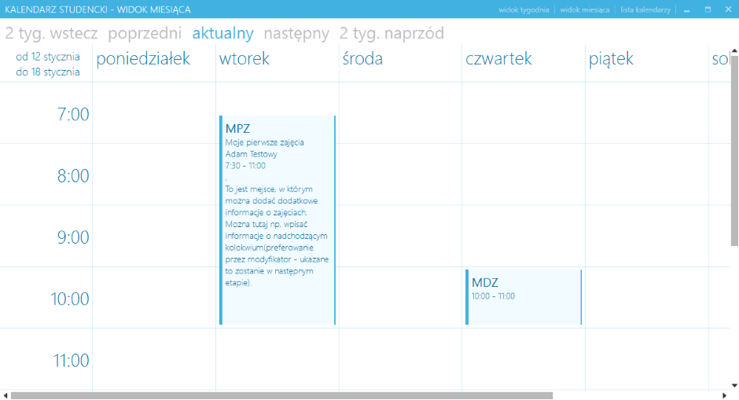

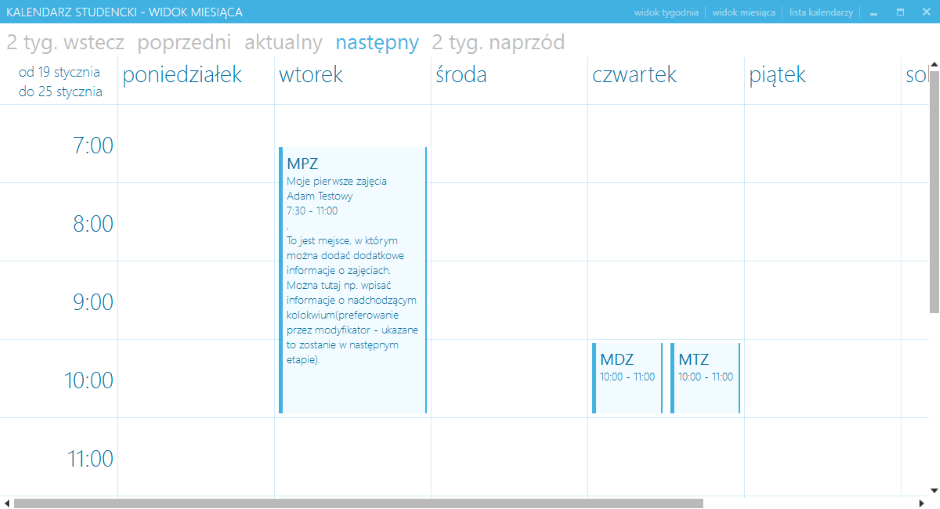

### Dalsze użycie aplikacji

Przy następnych uruchomieniach aplikacja domyślnie wyświetla widok tygodnia. Kalendarz jest wygenerowany na cały okres zaznaczony w ustawieniach, więc po utworzeniu go nie ma potrzeby żadnych zmian. Gdy kalendarz się przedawni, aplikacja wyświetli stosowny komunikat. Można wtedy utworzyć nowy kalendarz(i go aktywować) lub zmienić daty rozpoczęcia/zakończenia i używać istniejącego kalendarza.